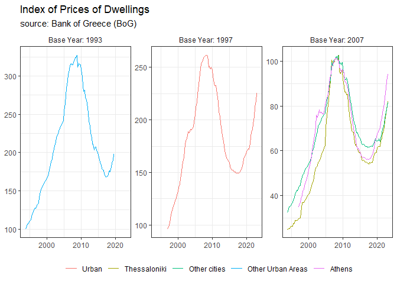
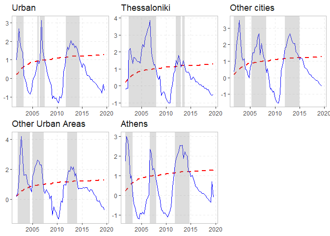

<!-- README.md is generated from README.Rmd. Please edit that file -->

# grdash: House Price Indices for Greece

<!-- badges: start -->
<!-- badges: end -->

Get the data from Bank of Greece website, which can be accessed through
[here](https://www.bankofgreece.gr/en/statistics/real-estate-market/residential-and-commercial-property-price-indices-and-other-short-term-indices).
The file `analysis.R` contains the recessary data manipulation in order
to bring our data in tidy format.

``` r
source("analysis.R")
prices <- get_hp()
prices
#> # A tibble: 518 x 4
#>    date       name  value  base
#>    <date>     <fct> <dbl> <dbl>
#>  1 1997-01-01 Urban  96.2  1997
#>  2 1997-04-01 Urban  98.2  1997
#>  3 1997-07-01 Urban 100.   1997
#>  4 1997-10-01 Urban 105.   1997
#>  5 1998-01-01 Urban 110.   1997
#>  6 1998-04-01 Urban 114.   1997
#>  7 1998-07-01 Urban 115.   1997
#>  8 1998-10-01 Urban 118.   1997
#>  9 1999-01-01 Urban 120.   1997
#> 10 1999-04-01 Urban 124.   1997
#> # ... with 508 more rows
```

Plot the data according to the base year in order to make meaningfull
comparisons.

``` r
prices %>% 
  mutate(base = paste0("Base Year: ", base)) %>% 
  ggplot(aes(date, value, col = name)) +
  geom_line() +
  facet_wrap(~ base, scales = "free_y", labeller = ) +
  theme_bw() +
  labs(
    title = "Index of Prices of Dwellings",
    subtitle = "source: Bank of Greece (BoG)"
  )+
  theme(
    axis.title = element_blank(),
    strip.background = element_blank(),
    legend.title = element_blank(),
    legend.position = "bottom"
  )
```

<!-- -->

``` r
prices %>% 
  mutate(base = paste0("Base Year: ", base)) %>% 
  group_by(name) %>% 
  mutate(ret = transx::ldiffx(value)*100) %>% 
  ggplot(aes(date, ret, col = name)) +
  geom_line() +
  geom_hline(yintercept = 0, linetype = "dashed") +
  facet_wrap(~ base, scales = "free_y") +
  theme_bw() +
  labs(
    title = "Prices of Dwellings, Quarterly Change",
    subtitle = "source: Bank of Greece (BoG)",
    y = "Change (%)"
  )+
  theme(
    axis.title = element_blank(),
    strip.background = element_blank(),
    legend.title = element_blank(),
    legend.position = "bottom"
  )
#> i Filling 1 value.
#> i Filling 1 value.
#> i Filling 1 value.
#> i Filling 1 value.
#> i Filling 1 value.
#> Warning: Removed 5 row(s) containing missing values (geom_path).
```

<!-- -->

``` r
prices %>% 
  mutate(base = paste0("Base Year: ", base)) %>% 
  group_by(name) %>% 
  mutate(ret = transx::ldiffx(value, 4)*100) %>% 
  # filter(name == "Thessaloniki") %>% 
  ggplot(aes(date, ret, col = name)) +
  geom_line() +
  geom_hline(yintercept = 0, linetype = "dashed") +
  facet_wrap(~ base, scales = "free_y") +
  theme_bw() +
  labs(
    title = "Prices of Dwellings, Annual Change",
    subtitle = "source: Bank of Greece (BoG)",
    y = "Change (%)"
  )+
  theme(
    axis.title = element_blank(),
    strip.background = element_blank(),
    legend.title = element_blank(),
    legend.position = "bottom"
  )
#> i Filling 4 values.
#> i Filling 4 values.
#> i Filling 4 values.
#> i Filling 4 values.
#> i Filling 4 values.
#> Warning: Removed 20 row(s) containing missing values (geom_path).
```

<!-- -->

## Exuberance analysis

Apply the Phillips et al (2015) GSADF recursive test in order to
identify periods of exuberance.

``` r
library(exuber)
rs <- prices %>% 
  select(-base) %>% 
  pivot_wider() %>% 
  drop_na() %>% 
  radf(., lag = 1)
#> Using `date` as index variable.
autoplot(rs)
#> Using `radf_crit` for `cv`.
```

<!-- -->
